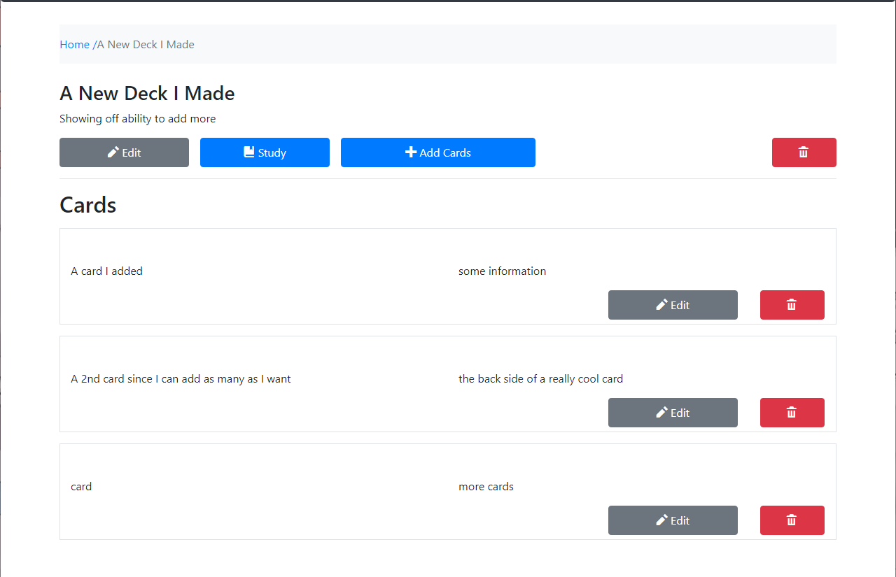
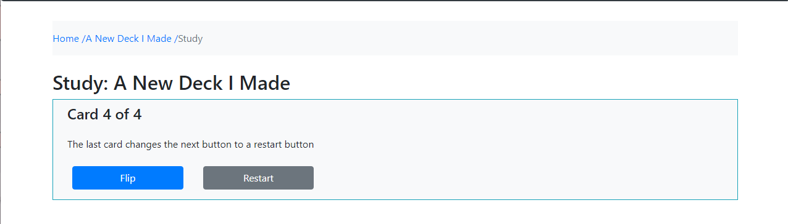

# Flash Card Project by Andrew Furrer

### A react app that allows user to create, edit, and delete virtual flashcards

## Features

### Homepage

On homepage all currently made decks are listend with information about them and buttons to edit them. 

Along with a button to create a new deck

### Deck Page

On deck page it will list all cards in the deck and each card will have an edit and delete button

And buttons to edit the deck itself, study it, or add more cards

 "Deck Page")

### Study Page

On study page it lists each card in the deck one at a time

Showing the front of the card first with a button to reveal the back along with a button to go to the next card

And on the last card it reveals a button to restart the deck

### Edit Page

Allows user to edit an individual card or a deck

Pulls information to auto fill form with what the current thing edited has

### Add Card to Deck Page

Allows user to add cards to a flashcard deck

And giving notification when a card is added to deck

